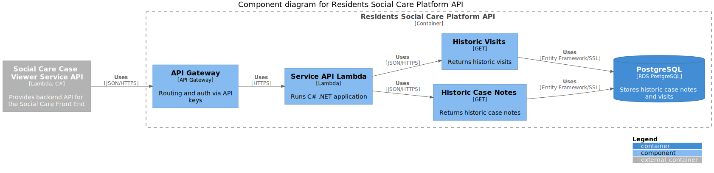

[](https://circleci.com/gh/LBHackney-IT/residents-social-care-platform-api)

# Residents Social Care Platform API

The Residents Social Care Platform API allows for services to retrieve
social care data of residents i.e. information formally managed by
Mosaic. It's part of the Social Care system (see [Social Care System Architecture](https://github.com/LBHackney-IT/social-care-architecture/tree/main) for more details).



## Table of contents

- [Getting started](#getting-started)
- [Usage](#usage)
  - [Running the application](#running-the-application)
  - [Running the tests](#running-the-tests)
- [Documentation](#documentation)
  - [Architecture](#architecture)
  - [API design](#api-design)
  - [Database](#database)
    - [Migrations](#migrations)
  - [Deployment](#deployment)
  - [Infrastructure](#infrastructure)
  - [Related repositories](#related-repositories)
- [Active contributors](#active-contributors)
- [License](#license)

## Getting started

### Prerequisites

- [AWS CLI](https://aws.amazon.com/cli/)
- [Docker](https://www.docker.com/products/docker-desktop)
- [.NET Core](https://dotnet.microsoft.com/download)

### Installation

1. Clone this repository

```sh
$ git clone git@github.com:LBHackney-IT/residents-social-care-platform-api.git
```

## Usage

### Running the application

#### With Docker

To serve the API using Docker, use:

```sh
$ make serve
```

The application will be served at http://localhost:3000 and expose the database
at port `7654`.

#### Without Docker

To serve the API locally without Docker, use:

```sh
$ cd ResidentsSocialCarePlatformApi && dotnet run
```

The application will be served at http://localhost:5000.

To serve the API locally without Docker and in watch mode (application will automatically recompile and run on saving changes to code), use:

```sh
$ cd ResidentsSocialCarePlatformApi && dotnet watch run
```

The application will be served at http://localhost:5000.

### Running the tests

There are two ways of running the tests against a test database: using the
terminal and using an IDE.

#### Using the terminal

To run all tests, use:

```sh
$ make test
```

#### Using an IDE

First start up the test database to run in the background, using:

```sh
$ make start-test-db
```

This will allow you to run the tests as normal in your IDE.

### Running migrations

While running the test database locally (i.e you are able to run tests from within your IDE), run any new migrations with:

```sh
$ make migrate-test-db
```

This will run migrations on the `socialcare` database on your local machine.
(Your IDE connects to the `socialcare` database hosted on your localhost to run tests and not to the docker container).

## Documentation

### Architecture

As this platform API is a part of the Social Care System, higher level documentation lives in a separate repository called [Social Care System Architecture](https://github.com/LBHackney-IT/social-care-architecture/).

To find out more about the process and tooling for our diagrams, see [Process documentation in Social Care System Architecture](https://github.com/LBHackney-IT/social-care-architecture/blob/main/process.md).

### API design

We use [SwaggerHub](https://swagger.io/tools/swaggerhub/) to document the API design, of which we have a version [hosted by SwaggerHub](https://app.swaggerhub.com/apis-docs/Hackney/residents-social-care-platform-api/1.0.0). This is used for designing endpoints as a contract before we create a new feature.

### Database

The platform API has one PostgreSQL database (as seen in the [C4 component diagram](./docs/component-diagram.svg)). It's managed using Terraform in the [Infrastructure repository](https://github.com/LBHackney-IT/infrastructure/tree/master/projects/mosaic).

A lot of the structure of the database has been determined by a database backup of Mosaic as this API supports the Social Care System by providing historic data to the [Social Care Case Viewer API](https://github.com/LBHackney-IT/social-care-case-viewer-api). This has been done by restoring Mosaic's backup and using AWS's Data Migration Service to migrate tables across to the platform API's database.

### Deployment

At the moment, we only have a production enviroment (Mosaic-Production AWS account) with a single deployment branch: `main`. This means pull request merges into `main` it triggers a deployment for Production.

We use [CircleCI](https://circleci.com) to handle deployment, see [CircleCI config](./.circleci/config.yml).

#### Migrations

For our database when developing locally and testing, we have migrations set up (see `/ResidentsSocialCarePlatformApi/V1/Infrastructure/Migrations`) which uses [EF Core Code](https://docs.microsoft.com/en-us/ef/core/managing-schemas/migrations/?tabs=dotnet-core-cli), see our documentation on:

- [Adding a migration](./docs/adding-a-migration.md)
- [Editing a migration](./docs/editing-a-migration.md)
- [Troubleshooting migrations](./docs/troubleshooting-migrations.md)

### Deployment

At the moment, we only have a production enviroment (Mosaic-Production AWS account) with a single deployment branch: `main`. This means pull request merges into `main` trigger deployments for Production.

We use [CircleCI](https://circleci.com) to handle deployment, see [CircleCI config](./.circleci/config.yml).

### Infrastructure

Resources such as the database are managed using [Terraform]([terr](https://www.terraform.io)) in [Infrastructure repository](https://github.com/LBHackney-IT/infrastructure/blob/master/projects/mosaic). Other resources such as the Lambda are managed by using the [Serverless framework](https://www.serverless.com) in [serverless.yml](ResidentsSocialCarePlatformApi/serverless.yml) within this repository.

### Related repositories

| Name | Purpose |
|-|-|
| [LBH Social Care Frontend](https://github.com/LBHackney-IT/lbh-social-care-frontend) | Provides the UI/UX of the Social Care System. |
| [Social Care Case Viewer API](https://github.com/LBHackney-IT/social-care-case-viewer-api) | Provides [service API](http://playbook.hackney.gov.uk/API-Playbook/platform_api_vs_service_api#a-service-apis) capabilities to the Social Care System. |
| [Mosaic Resident Information API](https://github.com/LBHackney-IT/mosaic-resident-information-api) | Provides [platform API](http://playbook.hackney.gov.uk/API-Playbook/platform_api_vs_service_api#b-platform-apis) capabilities by providing information about residents from Mosaic to the Social Care System. |
| [Infrastructure](https://github.com/LBHackney-IT/infrastructure) | Provides a single place for AWS infrastructure defined using [Terraform](https://www.terraform.io) as [infrastructure as code](https://en.wikipedia.org/wiki/Infrastructure_as_code) as part of Hackney's new AWS account strategy. NB: Due to its recent introduction, the Social Care System has infrastructure across multiple places. |
| [API Playbook](http://playbook.hackney.gov.uk/API-Playbook/) | Provides guidance to the standards of APIs within Hackney. |

## Active contributors

- **John Farrell**, Senior Software Engineer at Made Tech (john.farrell@hackney.gov.uk)
- **Renny Fadoju**, Software Engineer at Made Tech (renny.fadoju@hackney.gov.uk)
- **Neil Kidd**, Lead Software Engineer at Made Tech (neil.kidd@hackney.gov.uk)
- **Wen Ting Wang**, Software Engineer at Made Tech (wenting.wang@hackney.gov.uk)

## License

[MIT License](LICENSE)
